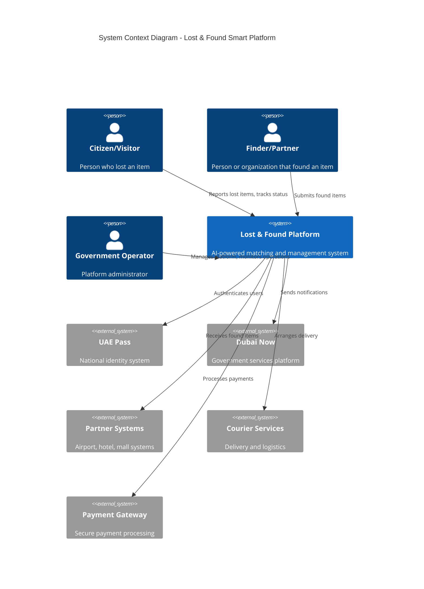
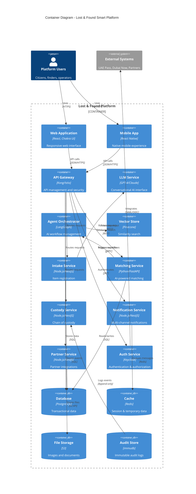
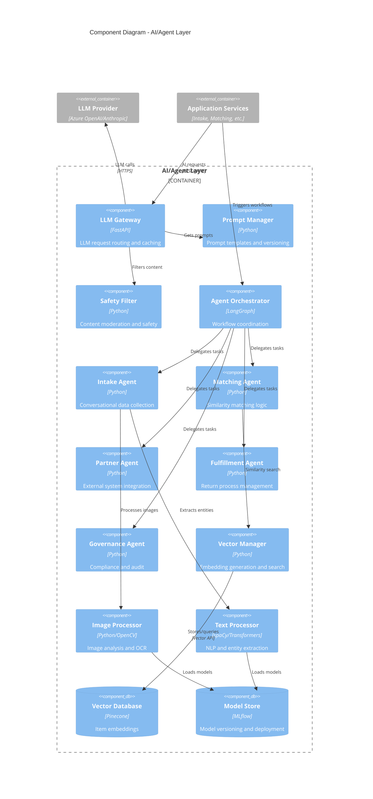
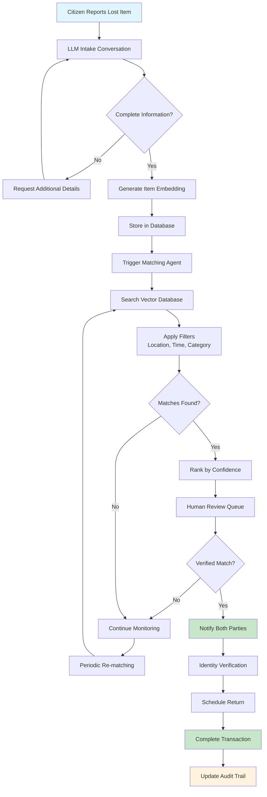
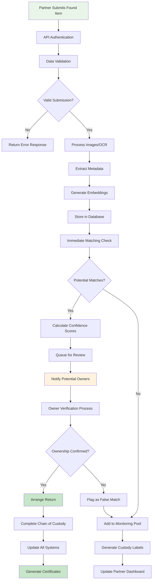
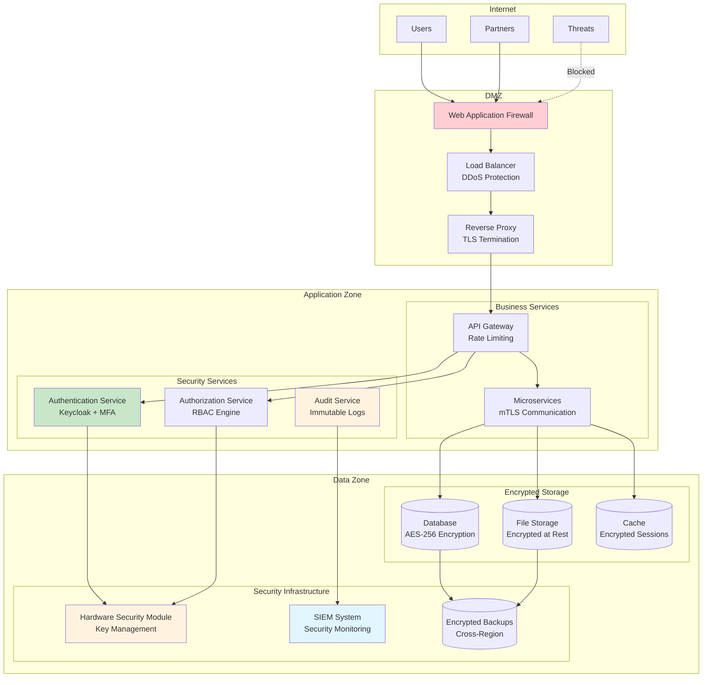
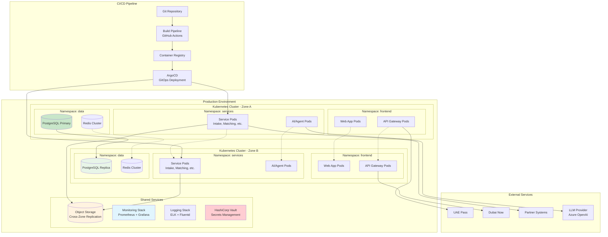
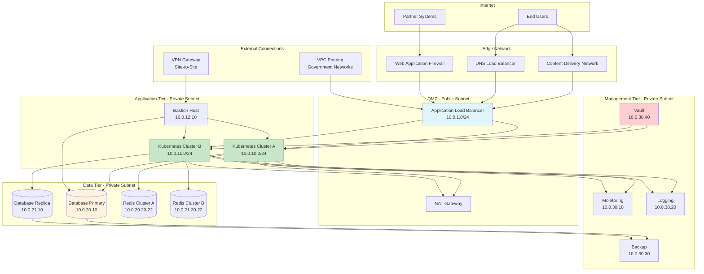
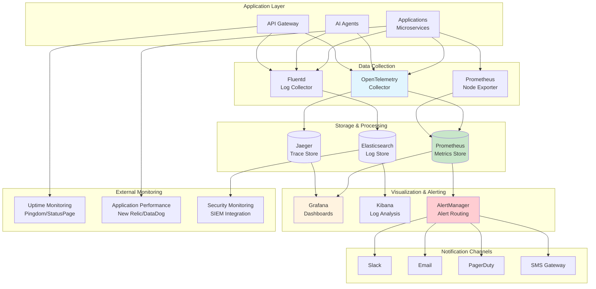

# Architecture Diagrams
## Lost & Found Smart Platform - Visual System Design

**Version:** 1.0  
**Date:** September 26, 2025  

---

## 1. System Context Diagram

---

## 2. Container Diagram

---

## 3. Component Diagram - AI/Agent Layer

---

## 4. Data Flow Diagram - Lost Item Journey

---

## 5. Data Flow Diagram - Found Item Journey

---

## 6. Security Architecture Diagram

---

## 7. Deployment Architecture Diagram

---

## 8. Network Architecture Diagram

---

## 9. Monitoring & Observability Architecture

---

**Document Control:**
- Version: 1.0
- Last Updated: September 26, 2025
- Next Review: October 10, 2025
- Classification: Internal Use Only
