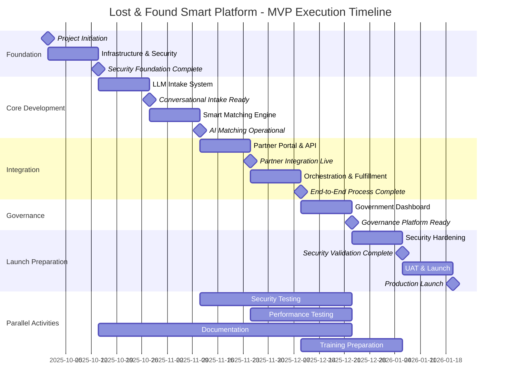

# Project Execution Plan
## Lost & Found Smart Platform - Agentic MVP

**Version:** 1.0  
**Date:** September 26, 2025  
**Document Owner:** Project Management Office  
**Status:** Draft for Approval  

---

## 1. Executive Summary

### 1.1 Project Overview
The Lost & Found Smart Platform MVP will deliver an AI-powered, city-wide ecosystem that reduces report handling time by 50% through conversational interfaces, intelligent matching, and seamless partner integrations while maintaining enterprise-grade security and compliance.

### 1.2 Project Scope
- **Duration:** 16 weeks (September 30, 2025 - January 26, 2026)
- **Budget:** $2.5M - $3.5M (estimated)
- **Team Size:** 15-20 professionals across development, AI/ML, security, and operations
- **Deliverables:** Production-ready MVP with full security compliance and partner integrations

### 1.3 Success Criteria
- ✅ Reduce average handling time from 48+ hours to <24 hours
- ✅ Achieve >75% match rate for reported items
- ✅ Support 10,000+ concurrent users with 99.9% uptime
- ✅ Pass independent security validation (SAST/DAST/Pen testing)
- ✅ Complete integration with 5+ major partners (airports, hotels, malls)

---

## 2. Project Phases & Milestones

### Phase 0: Project Initiation (Week -2 to 0)
**Duration:** 2 weeks  
**Key Activities:**
- Project charter approval and team formation
- Infrastructure procurement and setup
- Security framework establishment
- Stakeholder alignment and communication plan

**Deliverables:**
- [ ] Project charter signed
- [ ] Team onboarded and trained
- [ ] Development environment ready
- [ ] Security baseline established

### Phase 1: Foundation & Security (Weeks 1-2)
**Duration:** 2 weeks  
**Milestone:** Security Foundation Complete  

**Key Activities:**
- Infrastructure as Code (Terraform) setup
- Kubernetes cluster deployment
- Identity and Access Management (Keycloak) configuration
- CI/CD pipeline establishment
- Security scanning integration (SAST/DAST)
- Audit logging framework implementation

**Deliverables:**
- [ ] Production-ready infrastructure
- [ ] SSO with UAE Pass integration
- [ ] RBAC and MFA enforcement
- [ ] Immutable audit logging
- [ ] CI/CD pipeline with security gates
- [ ] Monitoring and alerting baseline

**Team:** DevOps (3), Security (2), Infrastructure (2)

### Phase 2: LLM Intake & Basic Forms (Weeks 3-4)
**Duration:** 2 weeks  
**Milestone:** Conversational Intake Ready  

**Key Activities:**
- LLM integration (Azure OpenAI/Claude)
- Conversational flow design and implementation
- Entity extraction and validation
- Photo upload and processing
- Multilingual support (Arabic/English)
- Form fallback implementation

**Deliverables:**
- [ ] Conversational intake interface
- [ ] Entity extraction pipeline
- [ ] Photo processing service
- [ ] Bilingual content management
- [ ] Input validation and sanitization
- [ ] User experience testing

**Team:** Frontend (3), AI/ML (3), Backend (2), UX (1)

### Phase 3: Smart Matching Engine (Weeks 5-6)
**Duration:** 2 weeks  
**Milestone:** AI Matching Operational  

**Key Activities:**
- Vector database setup (Pinecone/Weaviate)
- Embedding generation pipeline
- Similarity matching algorithms
- Geospatial and temporal filtering
- Confidence scoring system
- Human-in-the-loop workflows

**Deliverables:**
- [ ] Vector search infrastructure
- [ ] Matching algorithm implementation
- [ ] Confidence scoring system
- [ ] Review queue interface
- [ ] Performance optimization
- [ ] Accuracy validation testing

**Team:** AI/ML (4), Backend (3), Data (2)

### Phase 4: Partner Portal & API (Weeks 7-8)
**Duration:** 2 weeks  
**Milestone:** Partner Integration Live  

**Key Activities:**
- Partner authentication and authorization
- REST API development and documentation
- Bulk upload capabilities
- Data transformation and validation
- SLA monitoring and reporting
- Partner dashboard development

**Deliverables:**
- [ ] Partner API with OAuth2
- [ ] Bulk upload interface
- [ ] Data validation pipeline
- [ ] Partner dashboard
- [ ] API documentation
- [ ] SLA monitoring system

**Team:** Backend (4), Frontend (2), Integration (2), API (1)

### Phase 5: Orchestration & Fulfillment (Weeks 9-10)
**Duration:** 2 weeks  
**Milestone:** End-to-End Process Complete  

**Key Activities:**
- Identity verification (UAE Pass integration)
- Chain of custody implementation
- Appointment scheduling system
- Courier service integration
- Digital certificate generation
- Payment processing integration

**Deliverables:**
- [ ] Identity verification flow
- [ ] Custody tracking system
- [ ] Scheduling interface
- [ ] Courier integration
- [ ] Certificate generation
- [ ] Payment processing

**Team:** Backend (3), Integration (3), Frontend (2), Security (1)

### Phase 6: Government Dashboard & Analytics (Weeks 11-12)
**Duration:** 2 weeks  
**Milestone:** Governance Platform Ready  

**Key Activities:**
- Operational KPI dashboard
- Real-time analytics implementation
- Compliance reporting system
- Partner performance scorecards
- Predictive analytics setup
- Export and integration capabilities

**Deliverables:**
- [ ] Government operations dashboard
- [ ] Real-time analytics
- [ ] Compliance reporting
- [ ] Partner scorecards
- [ ] Data export capabilities
- [ ] SIEM integration

**Team:** Frontend (3), Analytics (2), Backend (2), Compliance (1)

### Phase 7: Security Hardening & Testing (Weeks 13-14)
**Duration:** 2 weeks  
**Milestone:** Security Validation Complete  

**Key Activities:**
- Comprehensive security testing (SAST/DAST)
- Independent penetration testing
- Vulnerability remediation
- Performance optimization
- Load testing and scaling validation
- Accessibility compliance testing

**Deliverables:**
- [ ] Security test results and remediation
- [ ] Penetration test report
- [ ] Performance benchmarks
- [ ] Accessibility compliance
- [ ] Load testing validation
- [ ] Security documentation

**Team:** Security (4), QA (3), Performance (2), DevOps (2)

### Phase 8: UAT, Training & Launch (Weeks 15-16)
**Duration:** 2 weeks  
**Milestone:** Production Launch  

**Key Activities:**
- User Acceptance Testing (UAT)
- Staff training and documentation
- Go-live preparation and rehearsal
- Production deployment
- Hypercare and monitoring
- Post-launch optimization

**Deliverables:**
- [ ] UAT completion and sign-off
- [ ] Training materials and sessions
- [ ] Production deployment
- [ ] Go-live checklist completion
- [ ] Hypercare support plan
- [ ] Launch retrospective

**Team:** Full team (15-20), Training (2), Support (3)

---

## 3. Detailed Gantt Chart

---

## 4. Resource Allocation

### 4.1 Team Structure

| Role | Count | Allocation | Key Responsibilities |
|------|-------|------------|---------------------|
| **Technical Lead** | 1 | 100% | Architecture oversight, technical decisions |
| **AI/ML Engineers** | 4 | 100% | LLM integration, matching algorithms, model optimization |
| **Backend Engineers** | 4 | 100% | Microservices, APIs, business logic |
| **Frontend Engineers** | 3 | 100% | Web/mobile interfaces, user experience |
| **DevOps Engineers** | 3 | 100% | Infrastructure, CI/CD, monitoring |
| **Security Engineers** | 2 | 100% | Security implementation, compliance, testing |
| **QA Engineers** | 2 | 100% | Testing automation, quality assurance |
| **Data Engineers** | 2 | 80% | Data pipelines, analytics, reporting |
| **UX Designer** | 1 | 60% | User experience design, accessibility |
| **Product Manager** | 1 | 100% | Requirements, stakeholder management |
| **Project Manager** | 1 | 100% | Project coordination, risk management |

**Total Team Size:** 24 professionals  
**Total Effort:** ~20 FTE over 16 weeks = 320 person-weeks

### 4.2 Budget Estimation

| Category | Cost Range | Notes |
|----------|------------|-------|
| **Personnel (16 weeks)** | $2.0M - $2.8M | Based on team size and rates |
| **Infrastructure** | $200K - $300K | Cloud services, licenses, hardware |
| **External Services** | $150K - $250K | LLM APIs, security testing, consulting |
| **Software Licenses** | $100K - $150K | Development tools, monitoring, security |
| **Contingency (15%)** | $375K - $525K | Risk mitigation buffer |
| **Total Project Budget** | **$2.8M - $4.0M** | Comprehensive delivery cost |

---

## 5. Risk Assessment & Mitigation

### 5.1 Technical Risks

| Risk | Probability | Impact | Mitigation Strategy |
|------|-------------|--------|-------------------|
| **LLM Performance Issues** | Medium | High | • Implement multiple LLM providers • Extensive prompt engineering • Fallback to traditional forms |
| **Matching Accuracy Below Target** | Medium | High | • Continuous model training • Human-in-the-loop validation • A/B testing of algorithms |
| **Integration Complexity** | High | Medium | • Early partner engagement • Robust error handling • Comprehensive testing |
| **Performance Under Load** | Medium | High | • Load testing from week 8 • Auto-scaling architecture • Performance monitoring |
| **Security Vulnerabilities** | Low | Critical | • Security-first development • Regular security reviews • Independent testing |

### 5.2 Business Risks

| Risk | Probability | Impact | Mitigation Strategy |
|------|-------------|--------|-------------------|
| **Stakeholder Resistance** | Medium | Medium | • Regular communication • Early demos and feedback • Change management support |
| **Partner Non-Adoption** | Medium | High | • Clear value proposition • Incentive programs • Phased rollout approach |
| **Regulatory Changes** | Low | High | • Compliance monitoring • Flexible architecture • Legal consultation |
| **Budget Overrun** | Medium | Medium | • Regular budget reviews • Scope management • Contingency planning |
| **Timeline Delays** | Medium | High | • Agile methodology • Regular milestone reviews • Resource flexibility |

### 5.3 Operational Risks

| Risk | Probability | Impact | Mitigation Strategy |
|------|-------------|--------|-------------------|
| **Key Personnel Unavailability** | Medium | Medium | • Knowledge documentation • Cross-training • Backup resources |
| **Infrastructure Failures** | Low | High | • Multi-zone deployment • Disaster recovery plan • Regular backups |
| **Data Loss or Corruption** | Low | Critical | • Immutable audit logs • Regular backups • Data validation |
| **Vendor Dependencies** | Medium | Medium | • Multiple vendor options • SLA agreements • Contingency plans |

---

## 6. Quality Assurance Plan

### 6.1 Testing Strategy

| Testing Type | Coverage | Timeline | Responsibility |
|--------------|----------|----------|----------------|
| **Unit Testing** | >90% code coverage | Continuous | Development teams |
| **Integration Testing** | All API endpoints | Weekly | QA team |
| **Security Testing** | SAST/DAST/IAST | Continuous | Security team |
| **Performance Testing** | Load/stress/endurance | Weeks 8-14 | Performance team |
| **Accessibility Testing** | WCAG 2.1 AA | Weeks 10-14 | QA + UX teams |
| **User Acceptance Testing** | End-to-end scenarios | Weeks 15-16 | Business stakeholders |
| **Penetration Testing** | Full security assessment | Week 13-14 | External vendor |

### 6.2 Quality Gates

| Phase | Quality Gate | Criteria |
|-------|--------------|----------|
| **Phase 1** | Security Foundation | • All security controls implemented • Audit logging functional • Access controls validated |
| **Phase 3** | AI Matching | • >80% matching accuracy • <5% false positive rate • Performance benchmarks met |
| **Phase 5** | End-to-End Flow | • Complete user journey functional • Integration tests passing • Performance targets met |
| **Phase 7** | Security Validation | • No critical vulnerabilities • Penetration test passed • Compliance requirements met |
| **Phase 8** | Production Readiness | • UAT sign-off received • Performance validated • Monitoring operational |

---

## 7. Communication Plan

### 7.1 Stakeholder Matrix

| Stakeholder Group | Interest Level | Influence Level | Communication Frequency |
|-------------------|----------------|-----------------|------------------------|
| **Project Sponsor** | High | High | Weekly |
| **Government Leadership** | High | High | Bi-weekly |
| **Technical Teams** | High | Medium | Daily |
| **Partner Organizations** | Medium | Medium | Monthly |
| **End Users** | Medium | Low | Milestone-based |
| **Security/Compliance** | High | High | Weekly |

### 7.2 Communication Channels

| Channel | Purpose | Frequency | Audience |
|---------|---------|-----------|----------|
| **Daily Standups** | Progress updates, blockers | Daily | Development teams |
| **Weekly Status Reports** | Progress, risks, issues | Weekly | Leadership, sponsors |
| **Monthly Steering Committee** | Strategic decisions, approvals | Monthly | Senior stakeholders |
| **Milestone Demos** | Progress demonstration | Bi-weekly | All stakeholders |
| **Risk Review Meetings** | Risk assessment, mitigation | Weekly | Project leadership |

---

## 8. Change Management

### 8.1 Change Control Process

1. **Change Request Submission**
   - Formal change request form
   - Impact assessment required
   - Business justification

2. **Change Evaluation**
   - Technical impact analysis
   - Cost and timeline assessment
   - Risk evaluation

3. **Change Approval**
   - Change Control Board review
   - Stakeholder approval required
   - Documentation updates

4. **Change Implementation**
   - Controlled implementation
   - Testing and validation
   - Communication to stakeholders

### 8.2 Scope Management

| Change Type | Approval Authority | Process |
|-------------|-------------------|---------|
| **Minor (< 5% budget/timeline)** | Project Manager | Simplified approval |
| **Major (5-15% budget/timeline)** | Steering Committee | Full change control |
| **Critical (> 15% budget/timeline)** | Project Sponsor | Executive approval |

---

## 9. Success Metrics & KPIs

### 9.1 Project Delivery Metrics

| Metric | Target | Measurement |
|--------|--------|-------------|
| **Schedule Performance** | 100% on-time delivery | Milestone completion dates |
| **Budget Performance** | Within 10% of approved budget | Actual vs. planned costs |
| **Quality Performance** | Zero critical defects in production | Defect tracking and resolution |
| **Scope Performance** | 100% of committed features delivered | Feature completion tracking |

### 9.2 Business Value Metrics

| Metric | Baseline | Target | Measurement Method |
|--------|----------|--------|-------------------|
| **Average Handling Time** | 48+ hours | <24 hours | System analytics |
| **Match Rate** | 45% | >75% | Matching algorithm metrics |
| **User Satisfaction** | N/A | >4.5/5.0 | User surveys and feedback |
| **System Uptime** | N/A | 99.9% | Monitoring and alerting |
| **Partner Adoption** | 0 | 5+ major partners | Integration tracking |

### 9.3 Technical Performance Metrics

| Metric | Target | Measurement |
|--------|--------|-------------|
| **API Response Time** | <500ms (95th percentile) | Performance monitoring |
| **Page Load Time** | <2 seconds | User experience monitoring |
| **Concurrent Users** | 10,000+ | Load testing validation |
| **Security Incidents** | Zero critical | Security monitoring |
| **Code Coverage** | >90% | Automated testing reports |

---

## 10. Post-Launch Support Plan

### 10.1 Hypercare Period (Weeks 17-20)

**Duration:** 4 weeks post-launch  
**Team Size:** 8-10 professionals  

**Activities:**
- 24/7 monitoring and support
- Rapid issue resolution
- Performance optimization
- User feedback collection
- System stability monitoring

### 10.2 Ongoing Operations

**Team Structure:**
- Operations Manager (1 FTE)
- DevOps Engineers (2 FTE)
- Support Engineers (3 FTE)
- AI/ML Engineer (0.5 FTE)
- Security Engineer (0.5 FTE)

**Responsibilities:**
- System monitoring and maintenance
- User support and training
- Continuous improvement
- Security updates and patches
- Performance optimization

---

## 11. Lessons Learned & Continuous Improvement

### 11.1 Knowledge Management

- **Documentation Repository:** Comprehensive technical and process documentation
- **Knowledge Transfer Sessions:** Regular sessions between teams
- **Best Practices Database:** Capture and share successful approaches
- **Post-Implementation Reviews:** Formal lessons learned sessions

### 11.2 Continuous Improvement Process

- **Monthly Performance Reviews:** System and process performance analysis
- **Quarterly Business Reviews:** Stakeholder feedback and improvement planning
- **Annual Architecture Reviews:** Technology and architecture evolution planning
- **User Feedback Integration:** Continuous user experience improvement

---

## 12. Approval & Sign-off

| Role | Name | Signature | Date |
|------|------|-----------|------|
| **Project Sponsor** | | | |
| **Technical Lead** | | | |
| **Security Officer** | | | |
| **Operations Manager** | | | |
| **Quality Assurance Lead** | | | |
| **Business Stakeholder** | | | |

---

**Document Control:**
- Version: 1.0
- Last Updated: September 26, 2025
- Next Review: October 10, 2025
- Classification: Internal Use Only
- Distribution: Project Team, Stakeholders, Management
