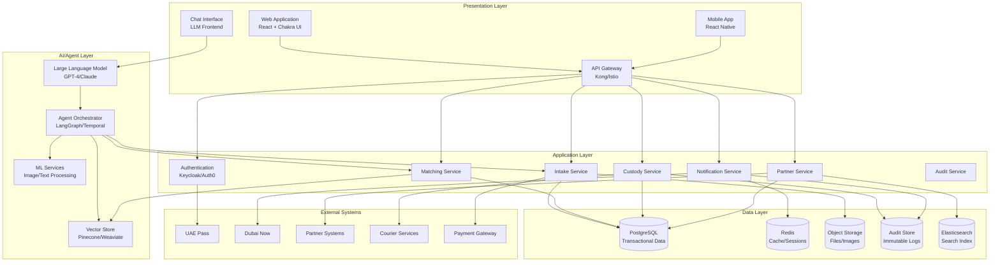
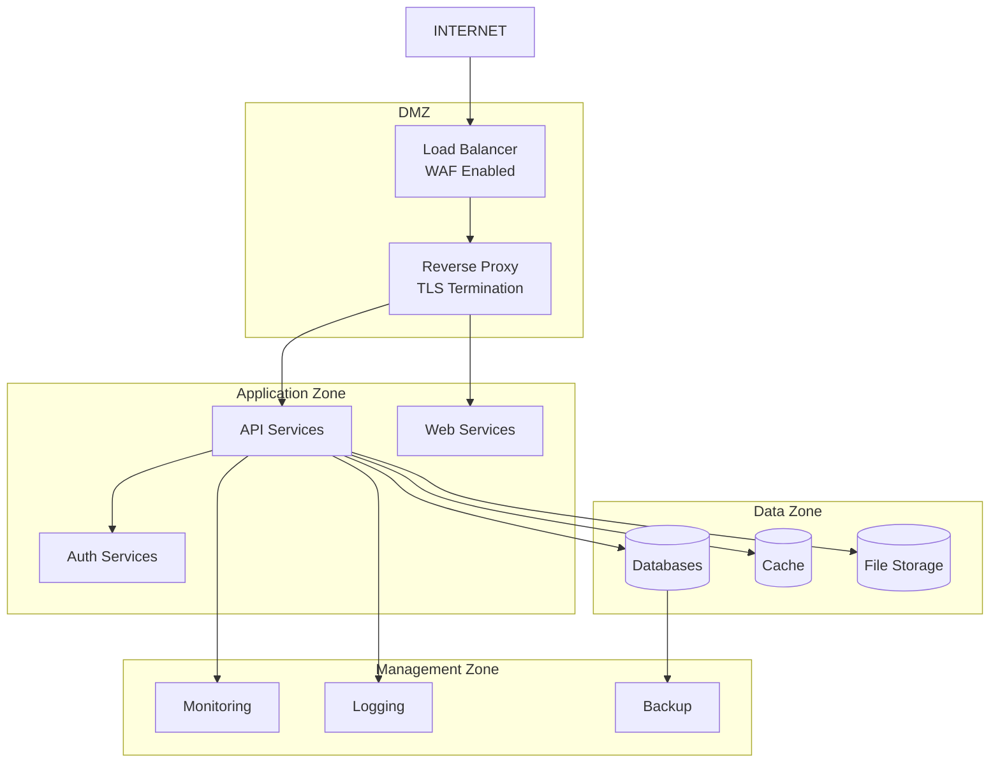
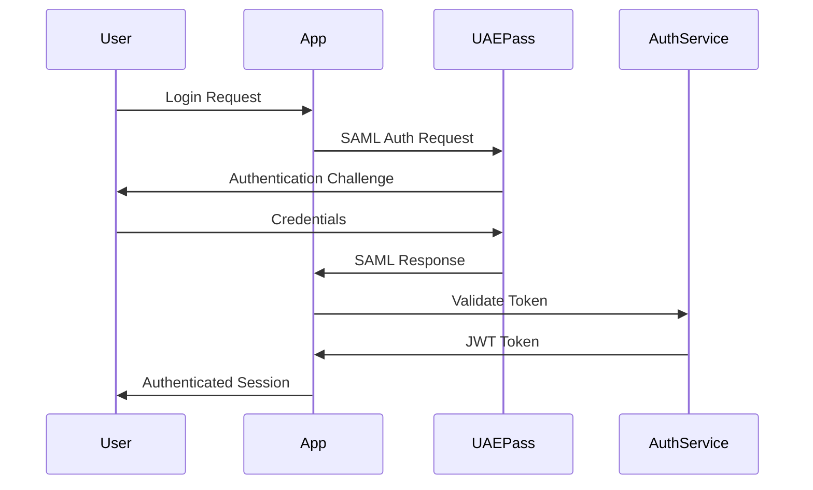
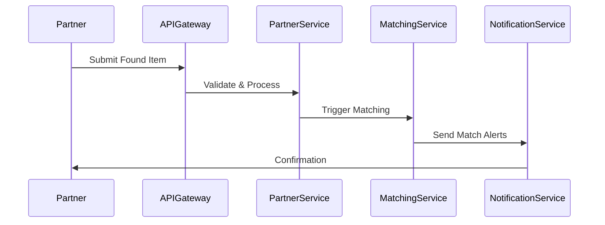
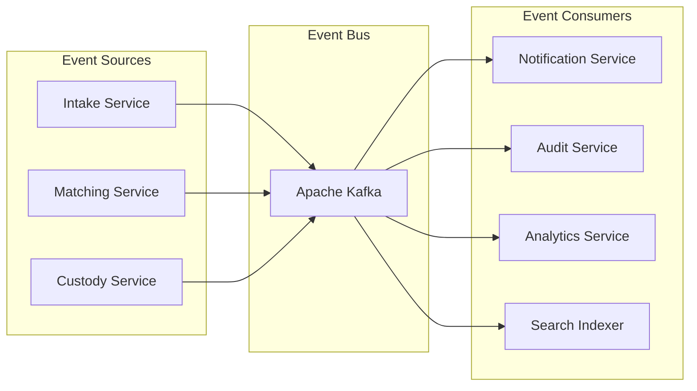
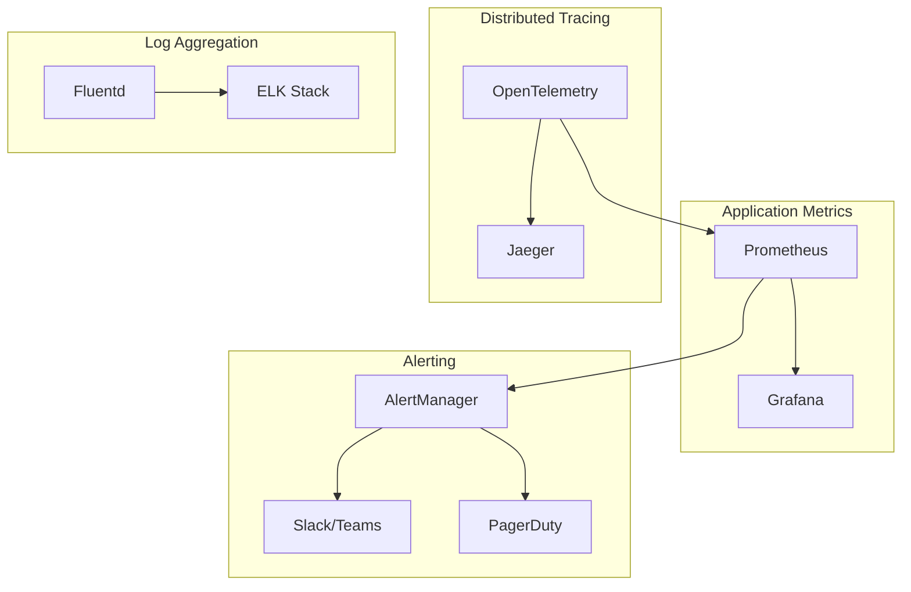

# Technical Architecture Document
## Lost & Found Smart Platform - Agentic MVP

**Version:** 1.0  
**Date:** September 26, 2025  
**Document Owner:** Technical Architecture Team  
**Status:** Draft for Review  

---

## 1. Architecture Overview

### 1.1 System Vision
The Lost & Found Smart Platform is built on a modern, cloud-native architecture that leverages agentic AI, LLM interfaces, and microservices to deliver a scalable, secure, and compliant solution for city-wide lost and found operations.

### 1.2 Architecture Principles
- **Security First:** Zero-trust architecture with defense in depth
- **AI-Native:** LLM and agent-driven workflows as core capabilities
- **Event-Driven:** Asynchronous processing for scalability and resilience
- **API-First:** All functionality exposed through well-defined APIs
- **Observability:** Comprehensive monitoring, logging, and tracing
- **Compliance:** Built-in audit trails and regulatory compliance

---

## 2. High-Level Architecture



---

## 3. Component Architecture

### 3.1 Presentation Layer

#### 3.1.1 Web Application
- **Technology:** React 18 + TypeScript + Chakra UI
- **Features:** Responsive design, PWA capabilities, offline support
- **Security:** CSP headers, XSS protection, HTTPS enforcement
- **Accessibility:** WCAG 2.1 AA compliance, screen reader support
- **Internationalization:** Arabic/English with RTL support

#### 3.1.2 Mobile Application
- **Technology:** React Native + Expo
- **Features:** Native performance, push notifications, camera integration
- **Platforms:** iOS 14+, Android 10+
- **Offline:** Local storage with sync capabilities

#### 3.1.3 API Gateway
- **Technology:** Kong Enterprise or Istio Gateway
- **Features:** Rate limiting, authentication, request/response transformation
- **Security:** OAuth2/JWT validation, IP whitelisting, DDoS protection
- **Monitoring:** Request tracing, metrics collection, health checks

### 3.2 AI/Agent Layer

#### 3.2.1 Large Language Model
- **Primary:** Azure OpenAI GPT-4 (private endpoint)
- **Fallback:** Anthropic Claude or local deployment
- **Features:** Conversational intake, entity extraction, multilingual support
- **Security:** Private networking, prompt injection protection
- **Monitoring:** Token usage, response quality, safety filters

#### 3.2.2 Agent Orchestrator
- **Technology:** LangGraph or Temporal Workflows
- **Agents:**
  - **Intake Agent:** Conversational data collection and validation
  - **Matching Agent:** Similarity search and candidate ranking
  - **Partner Agent:** External system integration and data normalization
  - **Fulfillment Agent:** Identity verification and return orchestration
  - **Governance Agent:** Compliance monitoring and audit trail maintenance
- **Features:** State management, error handling, human-in-the-loop workflows

#### 3.2.3 Vector Store
- **Technology:** Pinecone or Weaviate (self-hosted)
- **Data:** Item embeddings, image features, semantic search indices
- **Features:** Similarity search, metadata filtering, real-time updates
- **Security:** Encryption at rest, access controls, audit logging

#### 3.2.4 ML Services
- **Image Processing:** CLIP embeddings, object detection, OCR
- **Text Processing:** NER, sentiment analysis, language detection
- **Deployment:** Docker containers with GPU support
- **Scaling:** Kubernetes HPA based on queue depth

### 3.3 Application Layer

#### 3.3.1 Authentication Service
- **Technology:** Keycloak or Auth0
- **Features:** SAML/OIDC SSO, MFA, session management
- **Integration:** UAE Pass, Active Directory, LDAP
- **Security:** Password policies, account lockout, audit logging

#### 3.3.2 Intake Service
- **Responsibilities:** Item registration, photo processing, data validation
- **API:** REST endpoints for CRUD operations
- **Events:** Item registered, photos processed, validation completed
- **Storage:** PostgreSQL for metadata, S3 for files

#### 3.3.3 Matching Service
- **Responsibilities:** Similarity matching, candidate ranking, match validation
- **Algorithm:** Vector similarity + rule-based filters + ML scoring
- **Performance:** Sub-second response for real-time matching
- **Events:** Match found, confidence scored, human review required

#### 3.3.4 Custody Service
- **Responsibilities:** Chain of custody, location tracking, transfer management
- **Features:** QR code generation, custody events, compliance monitoring
- **Storage:** Immutable audit logs, location history
- **Integration:** Warehouse management, courier services

#### 3.3.5 Notification Service
- **Channels:** Email, SMS, push notifications, WhatsApp
- **Features:** Template management, delivery tracking, preferences
- **Integration:** SendGrid, Twilio, Firebase, WhatsApp Business API
- **Compliance:** Opt-out management, delivery confirmations

#### 3.3.6 Partner Service
- **Responsibilities:** Partner onboarding, API management, SLA monitoring
- **Features:** Bulk uploads, data transformation, validation
- **Security:** API key management, rate limiting, audit trails
- **Integration:** REST APIs, SFTP, webhook callbacks

### 3.4 Data Layer

#### 3.4.1 PostgreSQL Database
```sql
-- Core Tables
CREATE TABLE items (
    id UUID PRIMARY KEY,
    type VARCHAR(10) CHECK (type IN ('lost', 'found')),
    title VARCHAR(255) NOT NULL,
    description TEXT,
    category VARCHAR(50),
    location JSONB,
    date_reported TIMESTAMP,
    status VARCHAR(20),
    reporter_id UUID,
    created_at TIMESTAMP DEFAULT NOW(),
    updated_at TIMESTAMP DEFAULT NOW()
);

CREATE TABLE matches (
    id UUID PRIMARY KEY,
    lost_item_id UUID REFERENCES items(id),
    found_item_id UUID REFERENCES items(id),
    confidence_score DECIMAL(3,2),
    status VARCHAR(20),
    verified_by UUID,
    created_at TIMESTAMP DEFAULT NOW()
);

CREATE TABLE custody_events (
    id UUID PRIMARY KEY,
    item_id UUID REFERENCES items(id),
    event_type VARCHAR(50),
    location VARCHAR(255),
    actor_id UUID,
    metadata JSONB,
    timestamp TIMESTAMP DEFAULT NOW()
);
```

#### 3.4.2 Redis Cache
- **Session Storage:** User sessions, temporary data
- **Queue Management:** Background job queues, rate limiting
- **Cache:** Frequently accessed data, API responses
- **Configuration:** Cluster mode, persistence, encryption

#### 3.4.3 Object Storage (S3-compatible)
- **Structure:** Organized by item ID and file type
- **Security:** Encryption at rest (AES-256), access controls
- **Lifecycle:** Automated archival and deletion policies
- **CDN:** CloudFront or similar for global distribution

#### 3.4.4 Audit Store
- **Technology:** Immutable database (immudb) or append-only PostgreSQL
- **Data:** All system events, user actions, data changes
- **Retention:** 7-year minimum, configurable by data type
- **Compliance:** WORM storage, cryptographic verification

---

## 4. Security Architecture

### 4.1 Network Security


### 4.2 Identity & Access Management
- **Authentication:** Multi-factor authentication required
- **Authorization:** Role-based access control (RBAC)
- **Session Management:** Secure session tokens, timeout policies
- **API Security:** OAuth2 client credentials, JWT tokens
- **Audit:** All access attempts logged and monitored

### 4.3 Data Protection
- **Encryption in Transit:** TLS 1.3 for all communications
- **Encryption at Rest:** AES-256 for all stored data
- **Key Management:** Hardware Security Module (HSM) or cloud KMS
- **PII Protection:** Field-level encryption for sensitive data
- **Data Masking:** Anonymization in non-production environments

### 4.4 Application Security
- **Input Validation:** Comprehensive input sanitization
- **Output Encoding:** XSS prevention measures
- **SQL Injection:** Parameterized queries, ORM usage
- **CSRF Protection:** Token-based CSRF prevention
- **Security Headers:** HSTS, CSP, X-Frame-Options

---

## 5. Integration Architecture

### 5.1 External System Integrations

#### 5.1.1 UAE Pass Integration


#### 5.1.2 Partner API Integration


### 5.2 Event-Driven Architecture


---

## 6. Deployment Architecture

### 6.1 Kubernetes Deployment
```yaml
# Example deployment configuration
apiVersion: apps/v1
kind: Deployment
metadata:
  name: intake-service
spec:
  replicas: 3
  selector:
    matchLabels:
      app: intake-service
  template:
    metadata:
      labels:
        app: intake-service
    spec:
      containers:
      - name: intake-service
        image: lostfound/intake-service:v1.0.0
        ports:
        - containerPort: 8080
        env:
        - name: DATABASE_URL
          valueFrom:
            secretKeyRef:
              name: db-credentials
              key: url
        resources:
          requests:
            memory: "256Mi"
            cpu: "250m"
          limits:
            memory: "512Mi"
            cpu: "500m"
        livenessProbe:
          httpGet:
            path: /health
            port: 8080
          initialDelaySeconds: 30
          periodSeconds: 10
        readinessProbe:
          httpGet:
            path: /ready
            port: 8080
          initialDelaySeconds: 5
          periodSeconds: 5
```

### 6.2 Infrastructure Components
- **Container Orchestration:** Kubernetes 1.28+
- **Service Mesh:** Istio for traffic management and security
- **Ingress:** NGINX or Istio Gateway with TLS termination
- **Storage:** Persistent volumes for databases, object storage for files
- **Monitoring:** Prometheus + Grafana + Jaeger for observability
- **CI/CD:** GitLab CI or GitHub Actions with ArgoCD

---

## 7. Performance & Scalability

### 7.1 Performance Targets
- **API Response Time:** <500ms for 95th percentile
- **Page Load Time:** <2 seconds for initial load
- **Matching Speed:** <5 seconds for similarity search
- **Concurrent Users:** 10,000+ simultaneous users
- **Throughput:** 1,000+ requests per second

### 7.2 Scaling Strategy
- **Horizontal Scaling:** Auto-scaling based on CPU/memory/queue depth
- **Database Scaling:** Read replicas, connection pooling, query optimization
- **Caching Strategy:** Multi-layer caching (CDN, application, database)
- **Load Balancing:** Geographic distribution, health-based routing

### 7.3 Monitoring & Observability


---

## 8. Disaster Recovery & Business Continuity

### 8.1 Backup Strategy
- **Database Backups:** Continuous WAL archiving + daily full backups
- **File Storage:** Cross-region replication with versioning
- **Configuration:** Infrastructure as Code (Terraform) in version control
- **Recovery Testing:** Monthly DR drills and automated testing

### 8.2 High Availability
- **Multi-AZ Deployment:** Services distributed across availability zones
- **Database Clustering:** PostgreSQL with streaming replication
- **Load Balancing:** Health checks and automatic failover
- **Circuit Breakers:** Graceful degradation during outages

### 8.3 Recovery Objectives
- **RTO (Recovery Time Objective):** 4 hours maximum
- **RPO (Recovery Point Objective):** 1 hour maximum data loss
- **Availability Target:** 99.9% uptime (8.76 hours downtime/year)

---

## 9. Technology Stack Summary

### 9.1 Frontend Technologies
- **Web:** React 18, TypeScript, Chakra UI, PWA
- **Mobile:** React Native, Expo, Redux Toolkit
- **State Management:** Redux Toolkit Query, React Query
- **Testing:** Jest, React Testing Library, Cypress

### 9.2 Backend Technologies
- **Runtime:** Node.js 20 LTS or Python 3.11
- **Framework:** NestJS (Node.js) or FastAPI (Python)
- **Database:** PostgreSQL 15, Redis 7
- **Message Queue:** Apache Kafka or RabbitMQ
- **Search:** Elasticsearch 8

### 9.3 AI/ML Technologies
- **LLM:** Azure OpenAI GPT-4, Anthropic Claude
- **Vector Store:** Pinecone, Weaviate, or pgvector
- **ML Framework:** PyTorch, Transformers, LangChain
- **Image Processing:** OpenCV, PIL, CLIP

### 9.4 Infrastructure Technologies
- **Containers:** Docker, Kubernetes
- **Service Mesh:** Istio
- **Monitoring:** Prometheus, Grafana, Jaeger
- **CI/CD:** GitHub Actions, ArgoCD
- **IaC:** Terraform, Helm

---

## 10. Security Compliance Matrix

| Requirement | Implementation | Status |
|-------------|----------------|--------|
| TLS 1.2+/AES-256 | NGINX/Istio TLS termination, database encryption | ✅ |
| RBAC/MFA/AD/LDAP | Keycloak with UAE Pass integration | ✅ |
| Immutable Audit | Append-only PostgreSQL or immudb | ✅ |
| ISO 27001 | Security controls mapping and documentation | ✅ |
| NIST Framework | Control implementation and assessment | ✅ |
| CJIS Compliance | Data handling and access controls | ✅ |
| Independent Testing | SAST/DAST/Penetration testing | 🔄 |

---

## 11. Deployment Checklist

### 11.1 Pre-Deployment
- [ ] Infrastructure provisioning complete
- [ ] Security scanning passed (SAST/DAST)
- [ ] Performance testing completed
- [ ] Disaster recovery tested
- [ ] Security controls validated
- [ ] Compliance documentation complete

### 11.2 Deployment
- [ ] Blue-green deployment strategy
- [ ] Database migration scripts
- [ ] Configuration management
- [ ] Health check validation
- [ ] Monitoring setup
- [ ] Alerting configuration

### 11.3 Post-Deployment
- [ ] Smoke testing completed
- [ ] Performance monitoring active
- [ ] Security monitoring enabled
- [ ] User acceptance testing
- [ ] Documentation updated
- [ ] Team training completed

---

**Document Control:**
- Version: 1.0
- Last Updated: September 26, 2025
- Next Review: October 10, 2025
- Classification: Internal Use Only
